# Guess the Word

  

## Sobre

Este trabalho foi desenvolvido durante a disciplina de FPGA no segundo semestre do ano de 2022, pelos alunos:

- Marcelo Eduardo Rodrigues da Silva Filho (marceloer2011@gmail.com)

- Álvaro Masanori Sato (alvarosato00@gmail.com)

  

O objetivo desse trabalho, foi desenvolver um <b>jogo</b> de cunho educacional para auxiliar no engajamento dos alunos de diversas disciplinas na realização das atividades de tais.

  

O jogo tem o título de <b>*Guess the Word*</b> e funciona da seguinte maneira:

  

- Um enunciado será apresentado para você.

- A resposta para esse enunciado será uma única palavra (atenção para hífens).

- Você terá 6 chances para acertar a palavra.

- Cada questão vale 64 pontos no total, cada erro subtrai metade da pontuação atual dessa questão.

- Após cada chute, as letras mudarão de cor para te ajudar a chegar na resposta:

- A letra na cor VERDE :white_check_mark: indica que ela existe na palavra e está no local certo.

- A letra na cor AMARELO :yellow_heart: indica que ela existe na palavra e está no local errado.

- A letra na cor VERMELHO :x: indica que ela NÃO existe na palavra.

Exemplo sobre o sistema de **pontos**:

- Um jogo com 10 questões, tem pontuação total de 640 pontos, dando um chute e errando, você perde metade da pontuação atual da questão (32 pontos) e fica com 608 pontos, e isso segue adiante, diminuindo 16 no próximo erro, depois 8... Até que o jogador acerte (ou use todas as 6 tentativas) e vá para a próxima questão.

  
  

## Setup

Para o desenvolvimento desse trabalho foi utilizada principalmente a linguagem Python na versão 3.7.9. Além de claro, Javascript, HTML e CSS.

  

O ferramenta principal foi o framework web [Django](https://docs.djangoproject.com/en/3.2/).

  

Além do framework, existem outros pacotes necessários para o funcionamento do projeto, segue uma lista com todas elas (a mesma lista pode ser vista também no arquivo `requirements.txt` na raiz do projeto):

  
 - asgiref 3.5.2
 - Brotli 1.0.9
 - dj-database-url 1.2.0
 - Django 3.2.16
 - docutils 0.19
 - gunicorn 20.1.0
 - psycopg2 2.9.5
 - python-dotenv 0.21.0
 - pytz 2022.4
 - sqlparse 0.4.3
 - typing-extensions 4.4.0
 - whitenoise 6.2.0

 
### Como rodar o projeto localmente

1. Recomenda-se o entendimento da linguagem Python e todo o ambiente de trabalho com a mesma, para facilitar o desenvolvimento e entendimento do projeto.

2. Primeiro, recomendamos a criação de um ambiente virtual Python, com o gerenciador de ambientes da sua preferencia, caso não tenha nenhum, o [venv](https://docs.python.org/3/library/venv.html) é uma ótima pedida.

3. Depois de ter o ambiente virtual e funcionando, ative-o e instale as dependências do projeto, que estão no arquivo `requirements.txt` na raiz do projeto, para isso utilize o pip, através de um comando parecido com isso:

	-  `pip install -r requirements.txt `

4. Agora crie um arquivo chamado `.env` que seja vizinho aos arquivos `manage.py` e `build.sh`, ou seja na seguinte pasta: `FPGA-GuessTheWord\GuessTheWord\`

	- Dentro desse arquivo defina as seguintes variáveis de ambiente:

	- SECRET_KEY='xxxxxxxxxxxxxxxxxx' (troque os 'x' por uma chave gerada aleatoriamente em algum [gerador](https://randomkeygen.com).)

	- DEBUG=true

	- ALLOWED_HOSTS='*'
	
	- DATABASE_URL="xxxxxxxxxxx' (com a url de conexao do seu banco de dados, local ou hosted)

5. Navegue com seu terminal até a pasta `FPGA-GuessTheWord\GuessTheWord\` (onde se encontra o arquivo `manage.py`) e execute os comandos:

	-  `python manage.py collectstatic --no-input`

	-  `python manage.py migrate`

6. Por fim basta executar o comando para rodar o servidor:

	-  `python manage.py runserver`

7. E acessar o endereço `http://127.0.0.1:8000` no seu navegador.

### Como hospedar o projeto (rodar em algum servidor)

1. Aqui é um trabalho mais complicado de explicar, porque depende muito onde se deseja hostear,

2. No nosso caso foi utilizada a plataforma [Render](https://render.com), eles tem um tutorial próprio de como hospedar aplicações Django no serviço deles, segue o link https://render.com/docs/deploy-django. Porém utilizamos o seguinte: https://testdriven.io/blog/django-render/

3. Mas em resumo, diante de todo o processo, o mais importante é definir:

	- O diretório raiz como: `GuessTheWord`

	- O comando de build como: `sh build.sh`

	- O comando de start como: `gunicorn GuessTheWord.wsgi:application`

  

## Desenvolvimento

Com o setup local feito, podemos falar sobre o desenvolvimento, para auxiliar aqueles que possam acabar vindo a realizar alguma contribuição no projeto (ou até nós mesmos no futuro).

  

Como já dito, o principal alicerce do projeto é o framework Django, caso você não conheça nada sobre o framework, é recomendado aprender um pouco, eles disponibilizam um tutorial para quem está começando. (https://docs.djangoproject.com/en/3.2/intro/tutorial01/)

  

### Estrutura

Agora que você virou o mestre do Django, a gente pode começar a falar sobre a estrutura do nosso projeto.

A verdade é que não existe muita saída quando se trata do Django, ele nos "força" a seguir determinada estrutura de projeto, e ela tem como pontos principais os seguintes elementos:

  

-  *Models*

-  *Views*

-  *Urls*

  

#### Models

Os *models* ou modelos, são classes definidas no projeto que representam tabelas no banco de dados. Ou seja, é com eles que a gente **modela** os tipos de dado que serão utilizados na aplicação.

  

Para exemplos e explicações profundas ver o link de referência.

  

Referência: https://docs.djangoproject.com/en/4.1/topics/db/models/

  
  

#### Views

As views são funções que tem o papel de receber requisições web, processá-las e retornar respostas web (que pode ser desde páginas inteiras em formato de templates, até pequenos itens para compor a página).

  

Referência: https://docs.djangoproject.com/en/4.1/topics/http/views/

  

#### Urls

Bom, as urls já são conhecidas, no Django nós atrelamos cada url a uma view específica, desse modo tal view vai processar as requisições enviadas para tal url e retornar uma resposta.

  

Referêcia: https://docs.djangoproject.com/en/4.1/topics/http/urls/

  
  

### Código e desenvolvimento

Explicada a estrutura, podemos mergulhar um pouco na forma como escolhemos usar a estrutura que o Django propõe a nosso favor, para criar a nossa aplicação. Tudo referente ao Django, se encontra nas pastas:

  

-  `FPGA-GuessTheWord/GuessTheWord/game/`

-  `FPGA-GuessTheWord/GuessTheWord/GuessTheWord/`

  

#### Banco de Dados (models)

Todos os *models* (cada um representando uma tabela no banco de dados) estão definidos como classes no arquivo:

`FPGA-GuessTheWord/GuessTheWord/game/models.py`.

  

E abaixo uma lista com os models existentes e seus campos (tabelas do banco e suas colunas):

-  **Question**: representa as questões dentro do jogo, utilizado para criar novas questões e exibi-las dentro do jogo.

	-  ***id***: campo gerado atomaticamente pelo django, é um identificador único para cada questão (chave primária).

	-  ***number***: campo que armazena um **número inteiro** que representa o número da questão.

	-  ***difficulty***: campo que armazena uma **string** que representa a dificuldade da questão, pode assumir um de 3 valores, sendo eles: *'Easy'*, *'Medium'* ou *'Hard'*.

	-  ***tip***: campo que armazena um **texto** que representa o enunciado da questão.

	-  ***subject***: campo que armazena uma **string** que representa a disciplina a qual essa questão pertence, atualmente pode assumir um de 4 valores, sendo as opções: *'Circuitos Digitais'*, *'Arquitetura de Computadores'*, *'Sistemas Operacionais 1'* ou *'Sistemas Operacionais 2'*.

	-  ***answer***: campo que armazena uma **string** que representa a resposta da questão.

  

-  **Player**: representa o jogador do jogo, utilizado para registrar os jogadores que iniciam um jogo e ter suas respostas atreladas a algum modelo.

	-  ***id***: campo gerado atomaticamente pelo django, é um identificador único para cada jogador (chave primária).

	-  ***nickname***: campo que armazena uma **string** que representa o apelido do jogador, é único.

  

-  **Round**: representa uma sessão do jogador, uma partida, serve para registrar o progresso do jogo de cada jogador.

	-  ***player***: campo de **chave estrangeira** que representa um jogador (model Player).

	-  ***subject***: campo igual ao subject do model *Question*, armazena a disciplina referente a essa partida.

	-  ***score***: campo que armazena um **número inteiro**, que representa a pontuação do jogador nessa partida até o momento.

	-  ***current_question***: campo que armazena um **número inteiro**, que salva a questão atual em que o jogador está.

  

-  **PlayerAnswer**: esse modelo tem como intuito, registrar TODAS as tentativas de resposta dos jogadores (cada uma das 6 possíveis em cada questão).

	-  ***round***: uma **chave estrangeira** que representa o *Round* no qual essa resposta foi feita.

	-  ***question_number***: um campo que armazena um **número inteiro**, representa o número da questão para o qual essa resposta foi dada.

	-  ***player_answer***: um campo que armazena uma **string** que representa a resposta dada.

	-  ***position_in_game***: um campo que armazena um **número inteiro** e representa a tentativa na qual essa resposta foi dada (lembrando que o jogo aceita até 6 tentativas)

	-  ***is_final_answer***: um campo **booleano** que representa se a resposta dada pelo usuário é final ou não (uma resposta é final, caso seja uma resposta correta ou caso seja a última tentativa possível no jogo).

  

Abaixo um diagrama que representa o nosso modelo de dados:

  

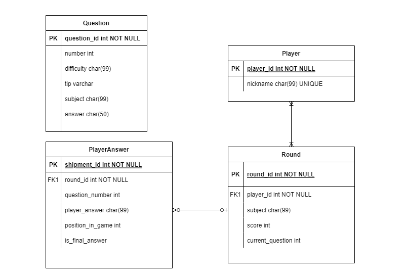

  

#### Views, Urls e Templates

  

As views, urls e templates são responsáveis pela parte visual do nosso jogo. Eles participam de uma dinâmica em que, através da interação com a interface do jogo (um template renderizado) o usuário envia uma requisição através de uma url, e uma view é encarregada de responder essa requisição, e geralmente responde com um novo template, ou com uma atualização no template atual. O diagrama abaixo ilustra esse fluxo.

  

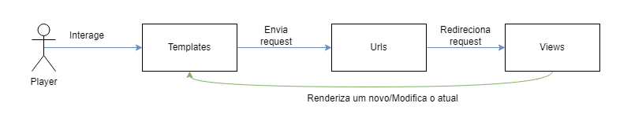

  

Um pouco sobre a localização dessas coisas todas:

  

- As views estão definidas em: `FPGA-GuessTheWord/GuessTheWord/game/views.py`.

- As urls estão definidas em: `FPGA-GuessTheWord/GuessTheWord/game/urls.py` e `FPGA-GuessTheWord/GuessTheWord/GuessTheWord/urls.py`.

- E os templates `FPGA-GuessTheWord/GuessTheWord/templates/`.

  

#### Uma explicacão rápida sobre as views/urls.

Aqui é importante conhecer os [tipos de requisição http](https://developer.mozilla.org/pt-BR/docs/Web/HTTP/Methods) e também o que é uma [requisição AJAX](https://www.treinaweb.com.br/blog/o-que-e-uma-requisicao-ajax), para entender mais facilmente a explicação das views.

  

Além de ter noção sobre o [Django ORM](https://tutorial.djangogirls.org/pt/django_orm/) e [dados dinâmicos nos templates](https://tutorial.djangogirls.org/pt/django_templates/).

  

Existem basicamente duas views (em forma de função) **play** e **register**.

  

-  **Register**: essa view é responsável por processar todas as interações do usuário com a página de registro/login (localizada na url `/`, ou raiz).

  

	- Ela verifica se a requisição é do tipo **GET,** se for, retorna apenas a página de login para o usuário.

	- Caso a request seja do tipo **POST**, quer dizer que o usuário está submetendo o formulário de login/registro. A view é então responsável por verificar qual o nickname e disciplina que o usuário submeteu, e caso não exista uma sessão do jogo para o usuário com esse nickname e para essa disciplina, a view cria um e retorna o usuário para o seu novo jogo (na url `/play/<numero_da_questao>:int`). Caso já exista uma sessão desse nickname para essa disciplina, a view retorna informações sobre isso e o template, que é renderizado dinamicamente, abre uma caixa de confirmação para verificar se o jogador que está tentando usar tal nickname é de fato o dono do nickname (e então entra o ultimo tipo de request).

	- Caso o jogador confirme que é ele o dono do nickname na caixa de confirmação aberta anteriormente, uma **AJAX** request é enviada para a view, e ela, percebendo o tipo da request, carrega o jogo relacionado a esse jogador + disciplina e redireciona para a página do jogo na questão em que o jogador parou anteriormente.

	- Vale citar que, em todos os casos, o id do Round (da sessão) criada ou resgatada, é salva nas variáveis de sessão do navegador, para posterior uso.

	- Abaixo imagens das telas explicadas.

	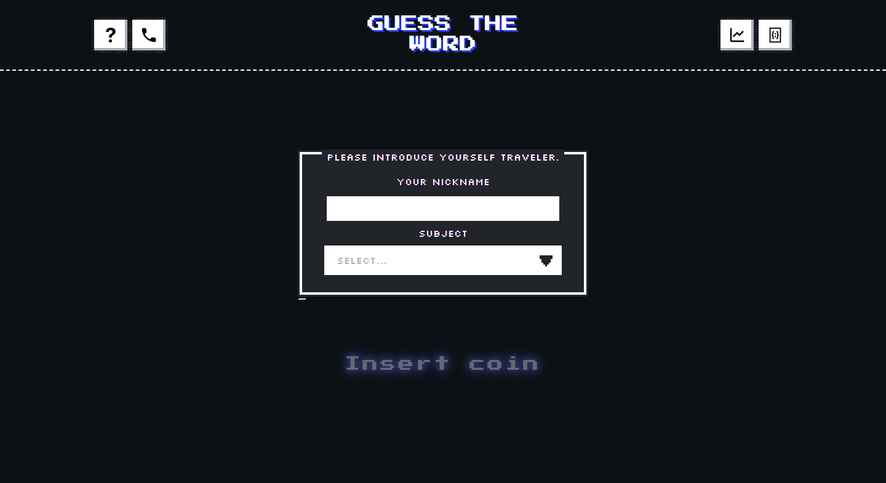

	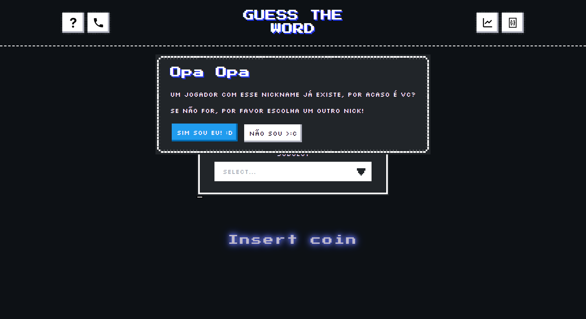

  

-  **Play**: essa view vai ser responsável por processar as interações do jogador com o jogo de fato (localizado na url `/play/<numero_da_questao>:int)`.

	- Caso a view perceba uma request do tipo **GET**, ela vai:

	- Carregar o round cujo id está salvo atualmente nas variáveis de sessão do navegador.

	- Carregar a questão cujo número está definido na url por um número inteiro.

	- Carregar todas as questões que o usuário já respondeu (para que seja possível mostrar as questões já respondidas por ele).

	- Carregar o número total de questões e a questão atual que o usuário se encontra.

	- Tudo isso será enviado junto para o template (que irá ser renderizado de acordo com cada informação) e o jogador será redirecionado para a página final.

	- Caso seja detectada uma request do tipo **AJAX** (que significa que o usuário errou todas as tentativas, ou acertou a questão) a view irá:

	- Carregar as respostas dadas pelo usuário e o Round correspondente.

	- Incrementar o número da questão na qual o usuário está.

	- Registra no banco a lista de tentativas do usuário nessa questão.

	- Redireciona o usuário para a questão seguinte.

	- Abaixo uma imagem da tela do jogo

  

	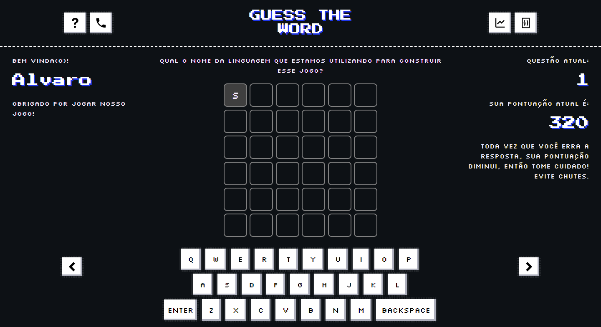

  
  

## Administração

A tela de administração será o melhor amigo de quem é responsável pelo jogo.

  

Para acessar essa tela, basta acessar a url `/admin`, e verá uma página semelhante a da imagem abaixo:

  

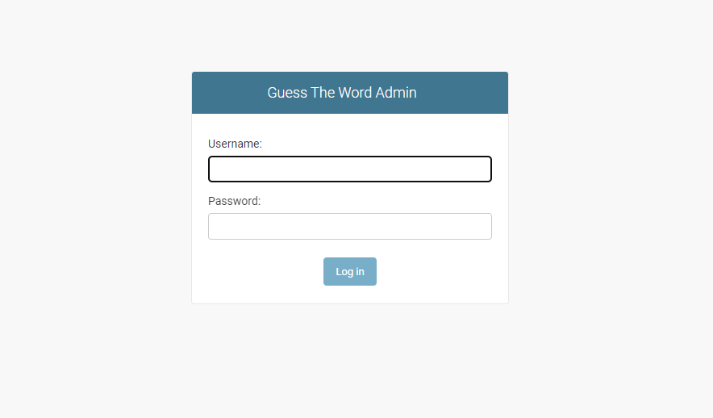

  

Vendo essa tela, basta acessar com as credenciais de administrador. E terá uma tela parecida com isso:

  

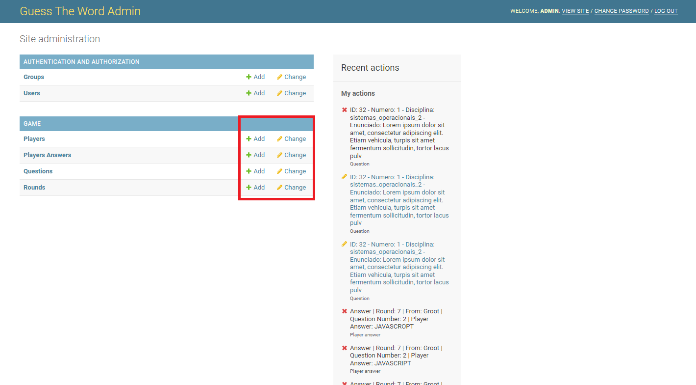

  

Na imagem acima, podemos ver destacado em vermelho os locais onde podemos adicionar ou editar novas instancias dos objetos:

  

- Players

- Players Answers

- Questions

- Rounds

  

Idealmente, **recomenda-se apenas a adição e remoção de Questions**, então iremos utilizar elas como exemplo (mas o mesmo serve para os outros objetos).

  

Clicando em `+ add` ao lado de Questions, temos acesso a página abaixo, onde podemos definir o número da questão, a dificuldade (uma caixa de seleção com easy, medium e hard), a disciplina (uma caixa de seleção com circuitos digitais, arquitetura de computadores, sistemas operacionais 1 e sistemas operacionais 2). Por fim, no canto inferior direito, temos as opções de **SALVAR** a nova questão.

  

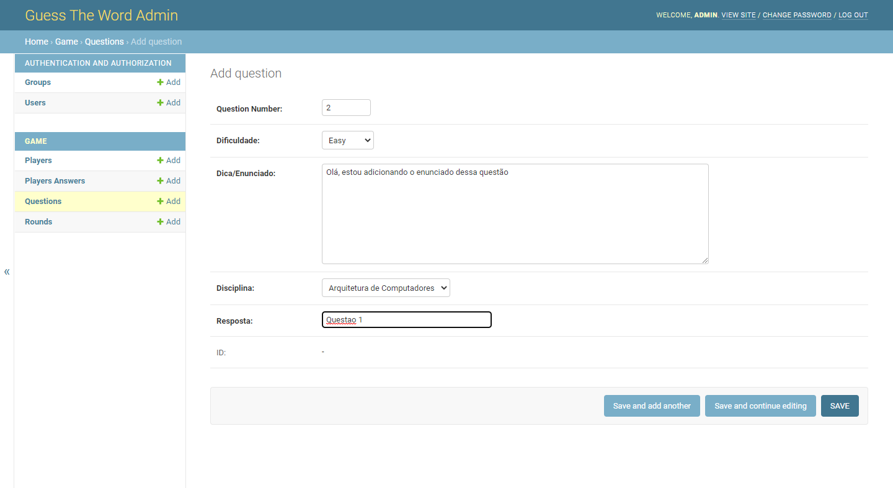

  

Partindo da mesma tela, e clicando diretamente no nome dos objetos (destacados em vermelho abaixo), podemos ver todos os existentes:

  

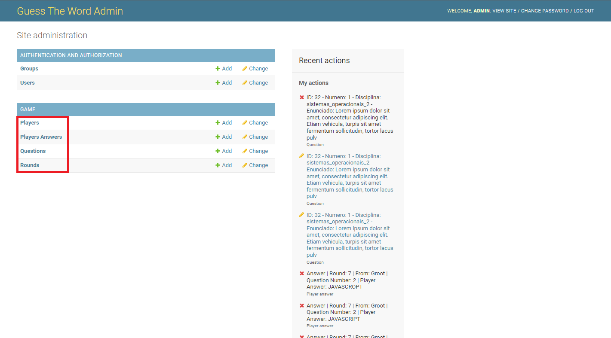

  

Como exemplo, temos abaixo todas as questões listadas. Podemos ver destacado em verde, a lista de questões (claramente placeholders) e destacado em vermelho os possíveis filtros (pode-se filtrar por disciplina e por dificuldade da questão).

  

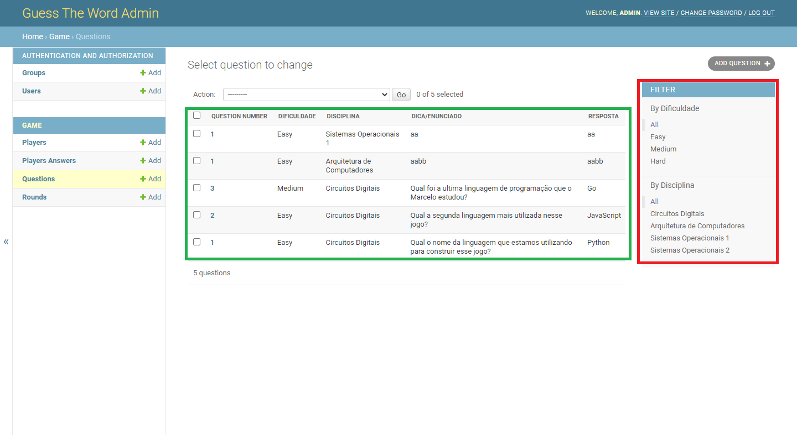

A partir dessa lista de objetos, é possível **editar** um objeto existente, clicando no campo que está na cor azul, nesse caso o Question Number. Uma tela semelhante a de criação de objeto se abrirá, porém com os campos já preenchidos e com uma opção de *DELETAR* caso se queira.

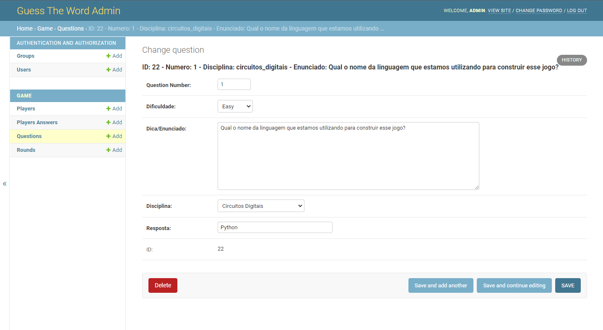

  

Por fim, uma pequena funcionalidade adicionada na aba de listagem de questões é a ação de ajuste do numero das questões.

Por exemplo, supondo que adicionamos as questões 1 a 10 e removemos a 3, é ideal adicionar uma questão 3 'nova' para que o jogo não quebre (incrementa de 1 em 1). Caso não seja possível, podemos usar essa funcionalidade que renumera todas as questões automaticamente, abaixo temos um passo a passo de como usar:

  

1. Selecione todas as questões clicando na caixa de seleção indicada.

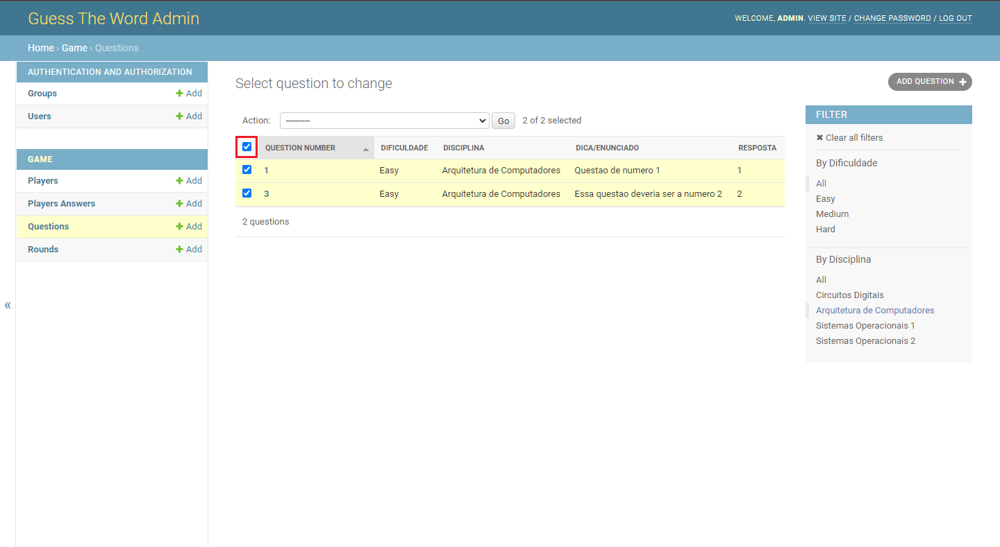

  

2. Em seguida, abra a caixa de seleção indicada em vermelho, escolha a disciplina a qual deseja renumerar as questões e clique no botão `go` em azul.

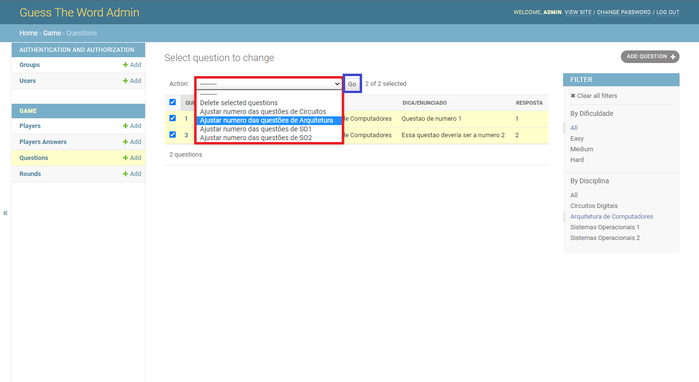

  

3. Por fim, o resultado será esse, note os números das questões reajustados.

  

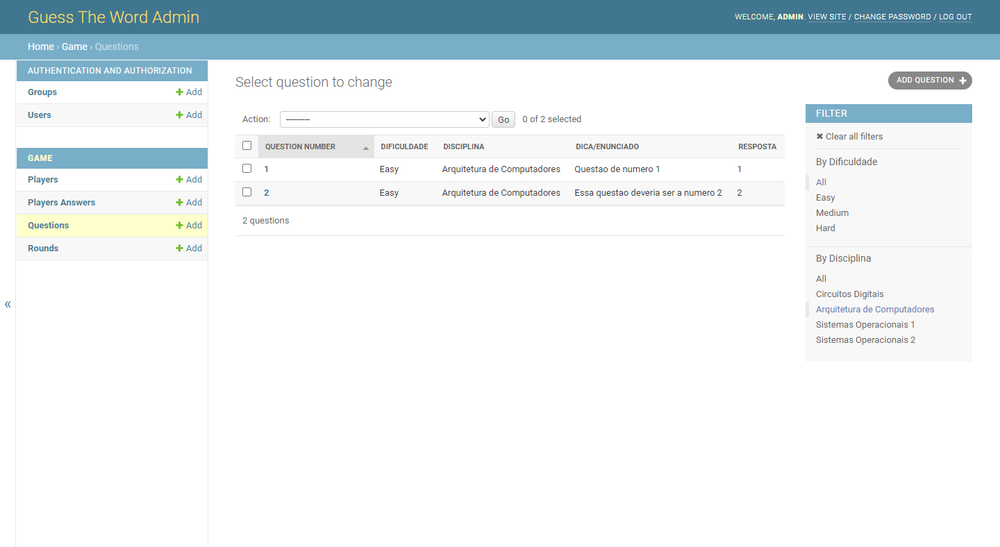

  
  
  

## Possíveis melhorias

  

Aceitar respostas maiores e mais complexas (não só uma ou poucas palavras). Atualmente temos problemas visuais com isso (respostas muito grandes saem da tela do jogo).

Backup de dados implementado.  

Adição de estatísticas internas na página de administração (acertos/tentativas do jogador e etc).

**IMPORTANTE:** 

A instância de banco de dados utilizadas é uma instância gratis do Render (https://render.com), possivelmente com o tempo de uso da aplicação essa instância execeda o limite de 1gb de dados. Uma solução temporária, é a cada turma que finalizar o jogo, o administrador deletar todas as instancias de Player pela tela de administração (isso deletará todos os Rounds de cada jogador e todas as PlayerAnswers).
